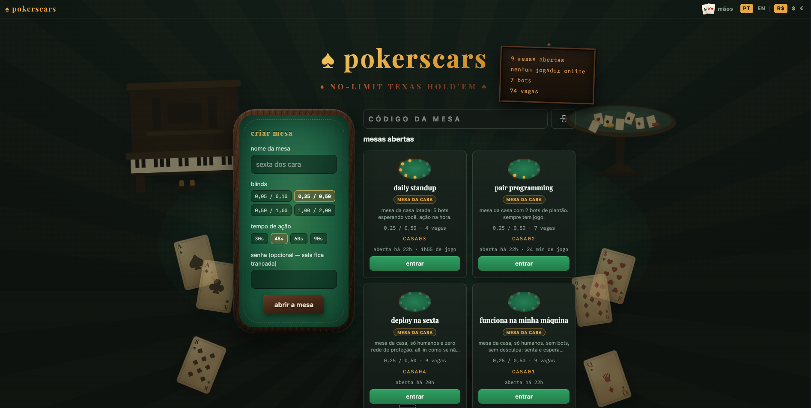

# pokerscars

No-Limit Texas Hold'em cash games to play with friends, in the browser, over
a shared link. Chips carry no real value here: the app keeps score the way a
notebook next to the felt would, one cashier tab per table, and it never
touches anyone's money. Rooms can be public or locked behind a password, and
a locked room also admits whoever carries a signed capability link.



The founding prompt lives in [`PROMPT.md`](PROMPT.md) (in Portuguese, kept as
history), the living plan in [`ROADMAP.md`](ROADMAP.md), and the design
notes in [`docs/`](docs/).

## Running it

```bash
docker compose up -d     # web on http://localhost:4300, Postgres on 5444
make                     # lists every target, grouped by context
make check               # the gate: format, warnings-as-errors, credo, dialyzer, tests
```

Everything runs in Docker, so there is no local Elixir to install. To play
with friends, expose the port with `ngrok http 4300` and share the table
link.

## Stack

Elixir 1.20 with Phoenix 1.8 and LiveView 1.2. Every screen is a LiveView
fed over PubSub, game state lives on the server, and there is almost no
JavaScript. Postgres 17 persists open tables and their ledgers, written
through from the table process on a best-effort basis so the game never
blocks on the database, and a restart restores every open table with its tab
intact.

Typing is a discipline rather than an afterthought: the 1.20 whole-program
type inference and Dialyzer (with `:unmatched_returns`) both run in
`make check`, structs guard every boundary, and every public function
carries a `@spec`, as laid out in `.claude/rules/typing.md`. The interface
speaks pt-BR as its source locale, English ships as a Gettext catalog, and
both locale and display currency are session preferences.

## Architecture

DDD with bounded contexts under `lib/pokerscars/`, each reachable only
through its public module. Phoenix is a delivery detail.

```
engine/   pure rules: cards, evaluation, betting, pots   (no processes, no Ecto)
table/    one GenServer per table: the aggregate root    (seats, clock, ledger)
bots/     bot players that use the same door humans do
```

The flow: a LiveView sends commands through `Pokerscars.Table`, the table's
GenServer applies them to an `Engine.Hand`, broadcasts
`{:table_updated, code}`, and every subscribed socket pulls its own
projection (`Table.View`). The projection is the only place that decides
what a player may see, so hole cards never leave the process for anyone
else's eyes.

## Engine algorithms

Hand evaluation categorizes and compares the C(7,5) = 21 five-card subsets
of each seven-card hand. There are no lookup tables: at nine seats a
showdown costs around 189 categorizations, which is microseconds, and
readable code beats shipping a 32 MB table. Correctness is exhaustive
rather than sampled, since one test evaluates all 2,598,960 five-card hands
and asserts the distribution matches the known frequency table, from the 40
straight flushes down to the 1,302,540 high cards.

The betting round is a state machine with four actions only
(`:fold | :check | :call | {:raise_to, n}`), where all-in is a consequence
and never an action. Two per-seat booleans, `acted_this_round?` and
`may_raise?`, carry the whole min-raise rule set, including incomplete
all-ins not reopening the action. A DFS test walks every legal action
sequence of whole hands for small configurations and asserts chip
conservation at every leaf.

Pots are derived, never accumulated: they are recomputed from each seat's
total contribution on demand. A contribution layer with a single
contributor was never called and is refunded, and that one branch covers
both the uncalled bet and the biggest-stack excess in multi-way all-ins.
Odd chips go to the first winner clockwise from the button, as the TDA rule
says they should.

The shuffle is Fisher-Yates over the stateless `:rand` API with the seed
injected by the table process (`:crypto.strong_rand_bytes` at the
boundary). The engine stays pure, every hand replays from
`{seed, button, seats}`, and property tests are deterministic.

## Bot heuristics

Bots (`lib/pokerscars/bots/bot.ex`) are processes that subscribe to the
table exactly like a LiveView does, wait a human-feeling delay, and act on a
hand-strength score with a little jitter. They are deliberately beatable and
exist for solo play. Preflop, pocket pairs score `0.55 + rank/31` and
unpaired hands score by combined rank with a suited bonus. Postflop, the
engine's own evaluator maps the made hand to a fixed strength. The policy
pot-raises at 0.75 or better, calls at 0.4, checks when it is free, calls
cheap bets with almost anything, and folds the rest; the jitter keeps them
from being fully predictable. They rebuy on their own when they bust.

## Testing

```bash
make test.run                       # whole suite (~2s, includes the exhaustive tests)
make test.watch F=path/to_test.exs  # one file or line
```

ExUnit plus StreamData. The suite covers the engine exhaustively (see
above), the table process (projections, turn clock, rebuy queue, showdown
reveals), the bots playing unattended, and the LiveViews end to end, with
two sessions playing a full hand through the rendered UI. Browser smoke
tests run via `agent-browser` before anything ships.

## License and model

AGPL-3.0. Run it anywhere, fork it, self-host it, and if you serve a
modified version over a network, share your changes back. The hosted
instance is free and plays with fictional chips only: the app is a
scorekeeper, it never holds or moves money, and that is a design decision
before it is a legal one. The name "pokerscars" stays with
[@leandronsp](https://github.com/leandronsp), which the license does not
cover. Terms of use live at `/termos` on the hosted instance.
