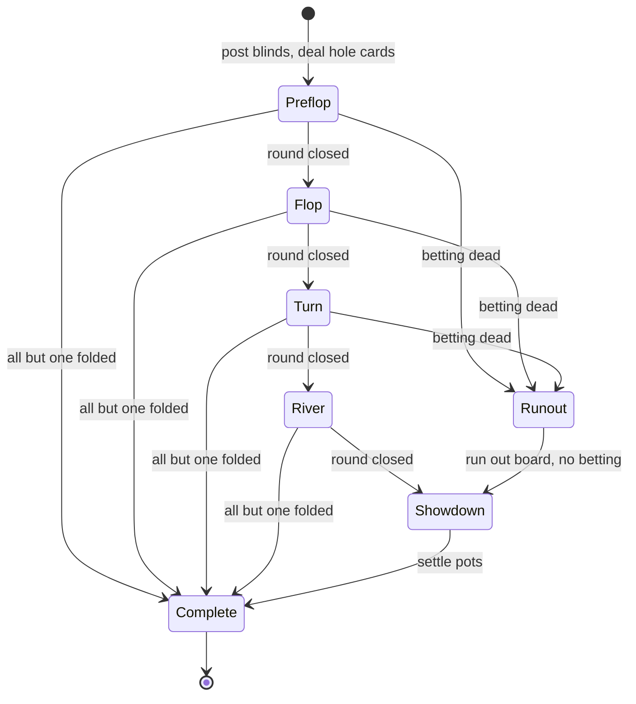

# Engine design — NLHE cash game

Step 1 R&D output. Scope: `lib/pokerscars/engine/`, pure functions only. No
processes, no Ecto, no side effects. The table GenServer (Step 4) owns the
engine state and is out of scope here.

Chips are integers (cents). `@type chips :: non_neg_integer()`.

## 1. Cards, deck, shuffle

`Card` is a struct, not a string: `%Card{rank: 2..14, suit: suit()}`, ace high
at 14, wheel handled inside the evaluator. `Deck` wraps the ordered list.

Shuffling is where purity and fairness pull against each other. Resolution:
**the engine never reads entropy**. `Deck.shuffle(deck, seed)` is deterministic
Fisher–Yates over `:rand.seed_s/2` + `:rand.uniform_s/2`, the *stateless*
`:rand` API that returns a new generator state instead of writing the process
dictionary. The caller (the table process) generates the seed with
`:crypto.strong_rand_bytes/1` at the boundary. The engine stays pure, tests get
a fixed deck from a fixed seed, and every hand replays from
`{seed, button, seats}`.

Accepted limitation: `exsss` carries 128 bits of state against 52! ≈ 2^226, so
not every permutation is reachable. Irrelevant here, since exploiting it means
observing the generator's output stream, which means already seeing whole
decks. If it ever matters, swap the body of `shuffle/2` for rejection sampling
over an entropy binary the caller supplies. The seam does not move.

Deliberately skipped: burn cards. They change nothing against a shuffled deck.

## 2. Hand evaluation — 7 cards

| Approach | Speed | Cost |
| --- | --- | --- |
| Naive categorize-and-compare | ~µs per 5-card hand | none |
| Cactus Kev (prime products, 5-card) | ~100ns | 4.9k-entry table, 5-card only |
| Two Plus Two (7-card direct lookup) | ~10ns | ~32 MB generated table |
| pokerkit | lookup per hand type | table generation at import |
| treys | Cactus Kev + **21 combinations for 7 cards** | table |

Speed figures are orders of magnitude from the literature, not measured here.
Note that treys, the most-used Python evaluator, already does the naive
combinatorial step for 7 cards, and Cactus Kev is explicitly a 5-card
algorithm, so 7-card use means iterating all `C(7,5) = 21` subsets regardless.

**Decision: categorize-and-compare over the 21 subsets. No lookup tables.**

A 9-handed showdown is 9 × 21 = 189 five-card categorizations, low single-digit
milliseconds in pure Elixir (inferred), against a human turn clock measured in
seconds. Correctness verifiable by reading the code is the actual requirement,
and a 32 MB table we would have to generate, ship and trust is a liability
rather than an optimization.

```elixir
@type category :: :high_card | :pair | :two_pair | :three_of_a_kind | :straight
                | :flush | :full_house | :four_of_a_kind | :straight_flush

%HandRank{category: category(), tiebreak: [2..14], cards: [Card.t()]}
```

`tiebreak` is a fixed-length descending rank list per category (`:two_pair` →
`[high_pair, low_pair, kicker]`, `:flush` → five ranks, `:straight` → the high
card, 5 for the wheel). `HandRank.compare/2` returns `:lt | :eq | :gt`: category
index first, then the lists element-wise. Same-length integer lists compare
lexicographically under Erlang term order, so the tiebreak comparison is free.
`Evaluator.evaluate([Card.t()]) :: HandRank.t()` takes 5, 6 or 7 cards and
returns the max; one `categorize_five/1` function is the whole algorithm.

## 3. Betting round state machine

The action union is deliberately four constructors:

```elixir
@type action :: :fold | :check | :call | {:raise_to, chips()}
```

All-in is **not** an action. It is a `:call` or a `{:raise_to, _}` that consumes
the stack. This is pokerkit's design (`check_or_call`,
`complete_bet_or_raise_to`) and it deletes an entire family of edge cases where
"all-in" and "raise" disagree about the resulting bet. Betting is also unified
with raising: with `bet_to_match = 0` postflop, `min_raise_to = 0 + big_blind`,
which is exactly the minimum bet.

### State

```elixir
# Seat.t()             status :: :active | :sitting_out | :waiting
%Seat{position: 0..8, player_id: String.t(), stack: chips(), status: status(),
      hand_state: :in_hand | :folded | :all_in, hole_cards: [Card.t()],
      committed: chips(),            # this street
      contributed: chips(),          # this hand — the only pot input
      acted_this_round?: boolean(), may_raise?: boolean()}

# BettingRound.t()
%BettingRound{street: street(), seats: [Seat.t()],   # ordered by position
              to_act: 0..8 | nil, bet_to_match: chips(),
              last_full_raise: chips(),  # min_raise_to = bet_to_match + this
              big_blind: chips(), last_aggressor: 0..8 | nil}
```

Every struct gets the real `@type t :: %__MODULE__{...}` in the source; the
above is the shape, compressed. Two booleans per seat carry the whole min-raise
rule set.

**Round closes** when every `:in_hand` seat has `acted_this_round? == true` and
`committed == bet_to_match`. That single invariant gives the big-blind option
for free: preflop the BB already matches `bet_to_match` but has not acted, so
the round stays open until they check or raise. No special case in the code.

**Min raise.** `min_raise_to = bet_to_match + last_full_raise`. Preflop opens
with both set to the big blind, so the minimum open is 2×BB.

**Reopening.** On a raise to `amount`, let `increment = amount - bet_to_match`.

- `increment >= last_full_raise` (full raise): set `last_full_raise = increment`,
  then for every other `:in_hand` seat set `acted_this_round? = false` and
  `may_raise? = true`.
- `increment < last_full_raise` (only legal when the raiser is all-in): leave
  `last_full_raise` **unchanged**, set `may_raise? = false` on seats whose
  `acted_this_round?` was already `true`, then reset `acted_this_round? = false`
  for all. Seats yet to act keep `may_raise? = true`.

Worked example, blinds 1/2. A raises to 6 (increment 4). B is all-in for 8
(increment 2, incomplete). A may now only call 2 or fold. C, who has not acted,
may still raise, and their minimum is `8 + 4 = 12`, not 10 — the incomplete
all-in does not shrink the raise increment. If C does raise to 12, that is a
full raise and A's right to re-raise comes back.

**Legal actions are computed, never guessed.** `BettingRound.legal_actions/1`
returns the allowed set plus `{:raise_to, min, max}` where
`max = committed + stack`, clamping `min` down to `max` when only an all-in
raise fits. The LiveView action bar renders straight off this. It is also where
"exactly one `:in_hand` seat remains, everyone else is all-in" collapses to
`[:fold, :call]`, since raising into a field that cannot call is better
disallowed than allowed-and-refunded.

### Lifecycle



Every street has the same two early exits: everyone folds to one player and the
hand ends with no cards shown, or betting is dead (at most one seat is neither
folded nor all-in) and the board runs out with no further action.

## 4. Pots and side pots

**Pots are derived, never accumulated.** The single source of truth is
`Seat.contributed`. `Pot.build/1` recomputes the structure from scratch
whenever it is asked. There is no incremental pot to drift out of sync, which
is where most reported engine bugs live.

```elixir
@type t :: %Pot{amount: chips(), eligible: [0..8]}

# Pot.build([Seat.t()]) :: {[Pot.t()], %{0..8 => chips()}}   # pots, refunds
```

Algorithm: take the distinct non-zero `contributed` values ascending. For each
consecutive pair, the slice is `level - previous`; contributors are the seats
with `contributed >= level`; the layer holds `slice * length(contributors)`.

- `length(contributors) == 1` → this money was never called. **Refund it**, do
  not make a pot. This one branch covers both the uncalled river bet everyone
  folded to and the excess of the biggest stack in a three-way all-in.
- otherwise → `%Pot{}` with `eligible` = contributors minus folded seats. A pot
  with one eligible seat is normal (folded money) and needs no showdown.

Folded seats' chips stay in the layers they paid into, they are just never
eligible. Main pot first.

**Odd chips.** Per pot: `base = div(amount, n)`, `extra = rem(amount, n)`. The
first `extra` winners clockwise from the seat left of the button get one extra
chip each. TDA rule for board games, and what people expect at a live table.

## 5. Button and blinds

Recommended rule set, the simplest thing that is still correct:

- Button advances clockwise to the next `:active` seat each hand.
- SB is the next `:active` seat after the button, BB the next after that.
- **Heads-up:** the button *is* the small blind, acts first preflop and last on
  every later street.
- A seat that cannot cover the blind posts all-in for what it has and is all-in
  preflop.
- **Joining mid-session:** the seat is `:waiting` and gets dealt in on the first
  hand where the rotation naturally puts it in the big blind. No posting, no
  dead blinds, no "wait or post" prompt.
- **Sitting out:** `:sitting_out` seats are skipped entirely by the rotation.

Deliberately skipped: the dead button (the real fix for blind dodging, but it
needs a phantom seat concept and nobody at a friends table is farming blinds),
missed-blind tracking and the dead-SB post, straddles, antes, run-it-twice.
Each is additive later and none of them changes the shapes above.

## 6. Lessons from existing engines

**pokerkit** (Python, validated against all 83 televised hands from the 2023
WSOP final table) splits a hand into nine phases and gives every operation a
verify / can / do triplet, so legality is a query before it is a mutation. We
take the triplet idea as `legal_actions/1` and reject the nine phases, most of
which exist for variants we do not play. **treys** confirms the 21-combination
step is normal practice for 7 cards even inside a table-based evaluator.
**dimun/poker_validator** is the only Elixir prior art worth naming: evaluation
only, no betting, no pots. There is no Elixir NLHE engine to borrow from, which
is the reason this document exists.

Bugs get reported in four consistent places: incremental side-pot bookkeeping
that drifts when a player folds after an all-in, uncalled bets swallowed into
the pot instead of refunded, heads-up all-ins that skip side-pot construction
entirely, and incomplete all-in raises wrongly reopening the action. The
derived-pots decision and the two-boolean reopening model are direct responses
to those four.

## 7. Modules

```
lib/pokerscars/engine.ex          # public facade — the only module other contexts call
lib/pokerscars/engine/card.ex     # struct, rank/suit types, parsing for fixtures
lib/pokerscars/engine/deck.ex     # new/0, shuffle/2, deal/2
lib/pokerscars/engine/hand_rank.ex   # struct + compare/2
lib/pokerscars/engine/evaluator.ex   # categorize_five/1, evaluate/1
lib/pokerscars/engine/seat.ex        # struct + status transitions
lib/pokerscars/engine/betting_round.ex  # legal_actions/1, apply_action/2, closed?/1
lib/pokerscars/engine/pot.ex         # build/1 → {pots, refunds}, award/3
lib/pokerscars/engine/showdown.ex    # settle/1 → [Award.t()]
lib/pokerscars/engine/button.ex      # rotation, blind seats, heads-up exception
lib/pokerscars/engine/hand.ex        # the state machine: start/4, act/3, advance/1
```

Invalid player actions arrive from the network, so they are a boundary:
`act/3` returns `{:error, :not_your_turn | :cannot_check | :raise_too_small |
:action_not_reopened | :insufficient_chips}`, never raises. Programming bugs
(a card dealt twice) do raise.

**Typing note.** `.claude/rules/typing.md` asks for `Ecto.Enum` on closed sets,
but the engine has no Ecto by design. Closed sets here are atom union `@type`s.
`Ecto.Enum` applies when these atoms reach a schema in `table/` or `ledger/`,
and must mirror the same atom list.

## 8. Testing strategy

`stream_data` is not yet in `mix.exs` — add `{:stream_data, "~> 1.0", only:
[:dev, :test]}` as the first commit of Step 2.

**Fixtures.** A table of `{seven_cards, expected_category, expected_tiebreak}`
read from a literal list in the test file, cards written as `"As Kd 7c ..."`.
Same shape for full hands: `{seed, seats, action_script, expected_stacks}`.

**Property tests.** Permutation invariance (shuffling the 7 cards never changes
the rank), suit-relabeling invariance, monotonicity (adding cards to a 5-card
hand never lowers its rank), total ordering of `compare/2`, shuffle produces a
permutation of the 52 with no duplicates, same seed produces the same deck, and
the big one: **chip conservation** — for any random legal action sequence, the
sum of stacks before the hand equals the sum after.

**Must have a test, individually named:**

*Evaluation*
1. Wheel A-2-3-4-5 ranks as a 5-high straight, below 6-high.
2. Straight flush beats quads when both exist in the same 7 cards.
3. Seven cards holding a flush and a separate straight, no straight flush.
4. Six- and seven-card flushes take the best five of the suit, not the first five.
5. Two sets (999 + 777 + K) makes nines full of sevens.
6. Three pairs in 7 cards: top two pairs, kicker may be the third pair's rank.
7. Quads take the highest of the three remaining cards as kicker.
8. Board plays for both players — exact tie.
9. Same pair, kicker decides.

*Betting*
10. Everyone limps, BB may raise; round does not close until BB acts.
11. BB checks the option, round closes.
12. Preflop minimum open is 2×BB; postflop minimum bet is BB.
13. Bet 100, raise to 300 → next minimum raise-to is 500.
14. Incomplete all-in: bet 100, all-in 140, bettor gets `:action_not_reopened`.
15. Same board, a player yet to act may raise, minimum 240 not 180.
16. Full all-in raise does reopen for a player who already acted.
17. Call larger than the stack caps at the stack and sets `:all_in`.
18. Everyone folds to the BB preflop: hand ends, no showdown, no cards revealed.
19. Everyone folds postflop: remaining streets are never dealt.
20. All but one player all-in: betting skipped, board runs out, then showdown.
21. Heads-up — button posts SB, acts first preflop, last postflop.
22. All-in seats are skipped in the action order but stay pot-eligible.
23. A blind smaller than the stack requirement posts all-in.
24. One `:in_hand` seat left facing an all-in may only fold or call.

*Pots*
25. All-in 300/500/800: main 900 (3 eligible), side 400 (2), 300 **refunded**.
26. Uncalled river bet returned to the bettor on top of the pot.
27. A folded player's chips remain in the pots they paid into.
28. Side pot won by a different player than the main pot.
29. Odd chip on a two-way split of 101 goes to the first winner left of the button.
30. Three-way split of 100 pays 34 / 33 / 33 in clockwise order from the button.

Cases 14, 15, 25 and 26 are the four that open-source engines get wrong most
often. They are the acceptance criteria for Step 3.

## 9. Decisions

| Decision | Alternatives rejected | Why |
| --- | --- | --- |
| Categorize + 21 combinations | Two Plus Two 32 MB table; Cactus Kev primes | Speed is irrelevant at 9 seats; readable code is not |
| Seed passed in, `:rand.seed_s` | `Enum.shuffle/1`; crypto inside the engine | Keeps the engine pure, hands replayable, tests deterministic |
| Pots derived from `contributed` | Incremental pot accumulator | Removes the drift bug class outright |
| Layer with one contributor → refund | Special-cased uncalled-bet handling | One branch covers both refund scenarios |
| Four actions, all-in implicit | Explicit `:all_in` action | Removes disagreement between the action and the resulting bet |
| Two booleans (`acted_this_round?`, `may_raise?`) | A `reopened?` flag on the round | Reopening is per-seat, not per-round |
| `legal_actions/1` returns min/max | Validate on submit only | UI cannot construct an illegal bet |
| Join only on the big blind | Post-or-wait, dead button, missed blinds | Correct and free; the rest is ceremony for a friends table |
| Odd chip left of the button | High card by suit | TDA rule for board games; matches live expectations |
| `{:error, atom}` for player actions | Raising | Actions come off the wire; this is a boundary |
| Atom unions in the engine | `Ecto.Enum` per the typing rule | The engine has no Ecto; enums mirror these at the schema layer |

## Sources

[PokerKit paper](https://ar5iv.labs.arxiv.org/html/2308.07327) ·
[pokerkit](https://github.com/uoftcprg/pokerkit) ·
[treys](https://github.com/ihendley/treys) ·
[Cactus Kev](http://suffe.cool/poker/evaluator.html) ·
[poker_validator](https://github.com/dimun/poker_validator) ·
[TDA rules](https://www.pokertda.com/view-poker-tda-rules/) ·
[TDA: all-in under a min-raise](https://www.pokertda.com/forum/index.php?topic=1287.0) ·
[button and blinds](https://www.pokerlistings.com/poker-guides/button-and-blind-use) ·
[side-pot pitfalls](https://bettoblock.com/build-poker-transaction-engine-pot-sidepot-management/)

